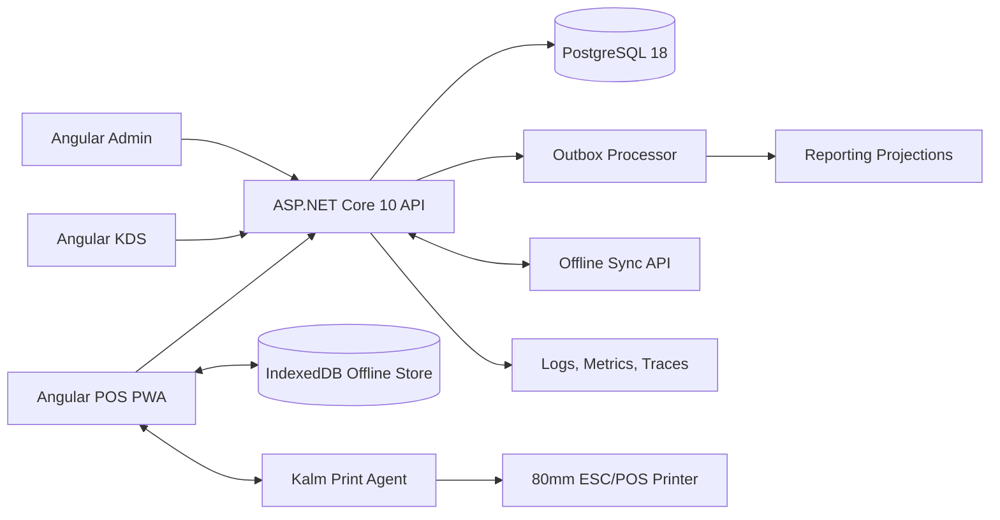
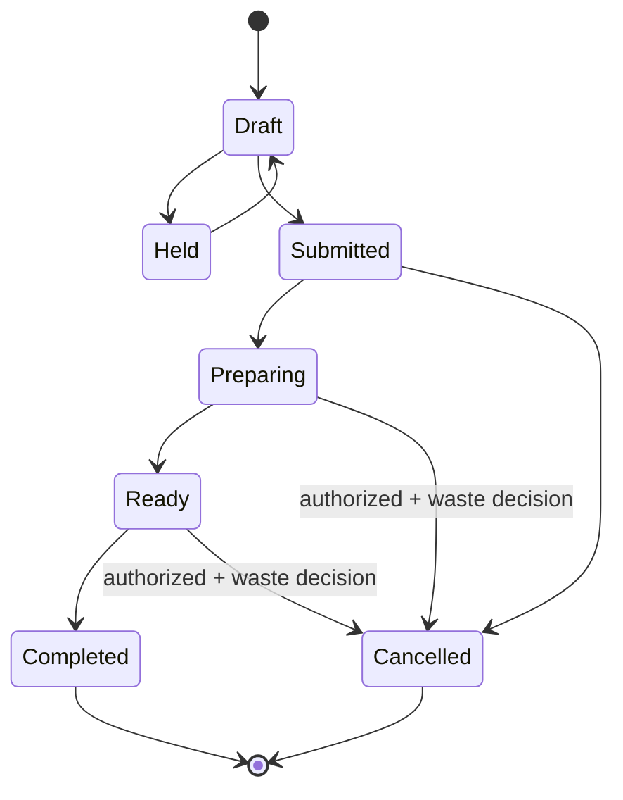
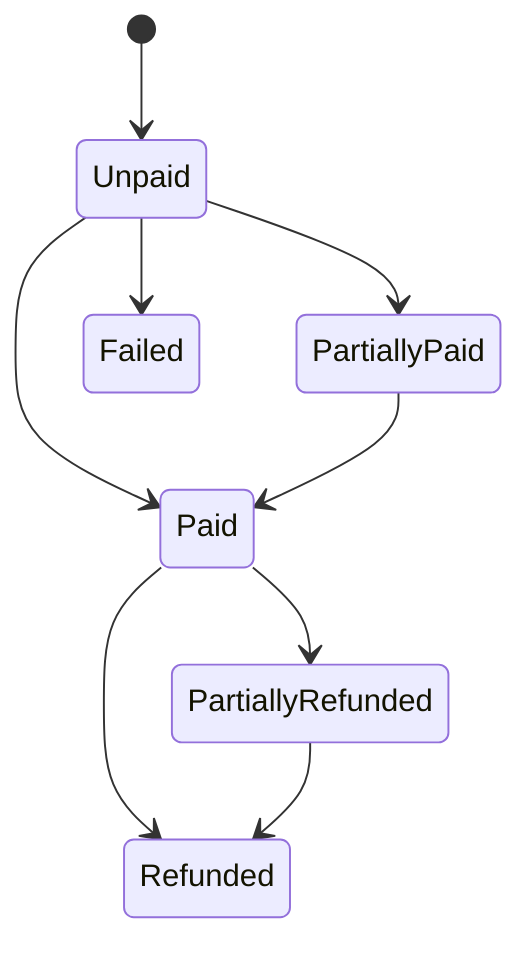
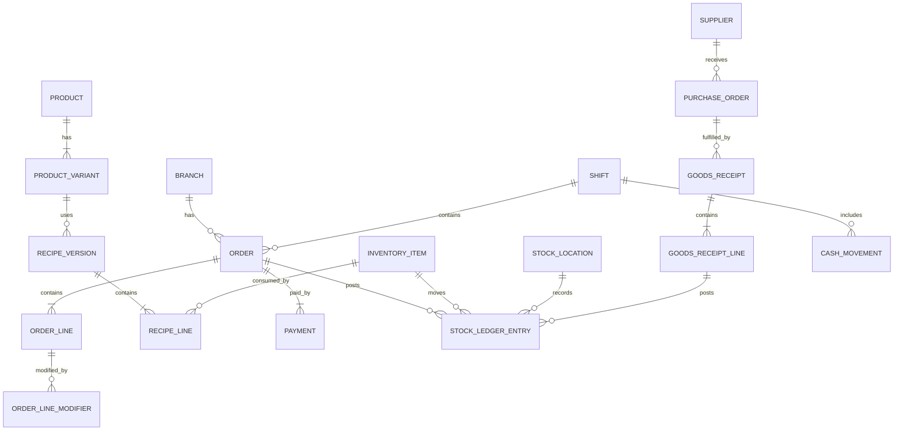

# Table of Contents

1. [Document Control](#document-control)
2. [Purpose](#1-purpose)
3. [Product Vision](#2-product-vision)
4. [Success Criteria](#3-success-criteria)
5. [Scope](#4-scope)
6. [Resolved Assumptions and Defaults](#5-resolved-assumptions-and-defaults)
7. [Stakeholders and User Roles](#6-stakeholders-and-user-roles)
8. [Glossary](#7-glossary)
9. [Technology and Architecture Baseline](#8-technology-and-architecture-baseline)
10. [Repository Structure](#9-repository-structure)
11. [Coding and Clean Architecture Requirements](#10-coding-and-clean-architecture-requirements)
12. [Brand and User Experience Requirements](#11-brand-and-user-experience-requirements)
13. [Functional Requirements](#12-functional-requirements)
14. [Permission Matrix](#13-permission-matrix)
15. [Data Model](#14-data-model)
16. [API Requirements](#15-api-requirements)
17. [Offline Data and Synchronization Design](#16-offline-data-and-synchronization-design)
18. [Non-Functional Requirements](#17-non-functional-requirements)
19. [Frontend Screen Inventory](#18-frontend-screen-inventory)
20. [Critical Business Rules](#19-critical-business-rules)
21. [Acceptance Scenarios](#20-acceptance-scenarios)
22. [Testing Strategy](#21-testing-strategy)
23. [DevOps and Environments](#22-devops-and-environments)
24. [Delivery Plan](#23-delivery-plan)
25. [Definition of Done](#24-definition-of-done)
26. [Codex Implementation Rules](#25-codex-implementation-rules)
27. [Go-Live Configuration Checklist](#26-go-live-configuration-checklist)
28. [Future Roadmap](#27-future-roadmap)
29. [Official Technology References](#28-official-technology-references)
30. [Final Product Decision](#29-final-product-decision)

# Document Control

| Field | Value |
|---|---|
| Document | Kalm Cafe Management System - Software Requirements Document |
| Version | 1.1 |
| Status | Approved implementation baseline |
| Date | 19 July 2026 |
| Product owner | Kalm Specialty Coffee |
| Primary implementation consumer | OpenAI Codex and the engineering team |
| Initial deployment | One Kalm branch in Cairo, Egypt |
| Architecture posture | Multi-branch ready modular monolith |
| Default currency | EGP |
| Default time zone | Africa/Cairo |
| Supported UI languages | Arabic (RTL) and English (LTR) |

## Change History

| Version | Date | Description |
|---|---|---|
| 1.0 | 15 July 2026 | Initial complete product, architecture, data, API, quality, and implementation specification. |
| 1.1 | 19 July 2026 | Product Owner foundation amendment: replaced Angular Material/CDK with stable PrimeNG 22 Styled Mode and the Aura-based KalmPreset. |

# 1. Purpose

This document defines the complete functional and non-functional requirements for the **Kalm Cafe Management System**, a modern point-of-sale and operational management platform for Kalm Specialty Coffee.

The system shall manage the full operational cycle of a cafe:

1. Menu and pricing.
2. Point-of-sale orders and payments.
3. Barista production tickets.
4. Shift opening, cash control, and shift closing.
5. Recipes and automatic ingredient consumption.
6. Inventory, stock counts, waste, transfers, and low-stock alerts.
7. Suppliers, purchasing, receiving, and purchase costing.
8. Expenses and operational cash movements.
9. Daily, shift, weekly, monthly, yearly, inventory, profitability, and audit reports.
10. Role-based access, device management, audit logging, backups, and future multi-branch support.

The document is intentionally implementation-ready. Codex shall treat it as the source of truth unless a later version or an explicit Product Owner decision supersedes it.

# 2. Product Vision

Kalm needs more than a receipt-printing cashier application. It needs a reliable operational control system in which every completed sale is connected to its recipe, every recipe affects inventory, every cash movement belongs to a shift, and every sensitive action is auditable.

The guiding product statement is:

> Sell quickly, prepare accurately, control stock, reconcile cash, and understand profitability without making daily cafe operations complicated.

The application must feel calm, modern, premium, warm, and uncluttered while remaining fast enough for a busy counter.

# 3. Success Criteria

The product is successful when all of the following are true:

- A cashier can create and pay a normal order in no more than 20 seconds after training.
- A sale automatically posts the correct theoretical ingredient and packaging consumption.
- Recipe replacements such as oat milk correctly remove the standard milk quantity and add the replacement quantity.
- Historical sales and cost reports remain unchanged when a recipe is edited later.
- A manager can close a shift using a blind cash count and see the expected-versus-actual difference.
- The owner can view accurate sales, payment, discount, refund, waste, stock, cost, and gross-profit reports by shift and time period.
- The system prevents unauthorized discounts, voids, refunds, stock adjustments, and shift reopening.
- The system continues taking permitted offline orders during an internet outage and synchronizes them without duplication.
- All critical business flows have automated tests and a traceable audit history.

# 4. Scope

## 4.1 In Scope

The complete target product includes:

- Authentication, employee PIN login, roles, permissions, and optional owner MFA.
- Organization, branch, device, printer, stock-location, and business-day configuration.
- Product catalog, categories, variants, sizes, prices, taxes, service charges, modifiers, and availability.
- POS cart, order lifecycle, dine-in, takeaway, manually recorded delivery, split payment, discounts, receipts, reprints, voids, cancellations, and refunds.
- Kitchen/Barista Display System (KDS) and production tickets.
- Shift and cash-drawer lifecycle including opening float, pay-ins, pay-outs, safe drops, blind close, and variance.
- Units of measure, unit conversion, inventory items, stock ledger, balances, lots/expiry, counts, transfers, waste, and reorder rules.
- Recipe definitions, recipe versions, variant-specific recipes, modifier recipe deltas, yield, and theoretical consumption.
- Supplier directory, supplier items, purchase orders, goods receipts, supplier invoices, and supplier payments/credit balances at an operational level.
- Expense categories, expenses, attachments, and drawer-linked expenses.
- Dashboards and reports for sales, profitability, inventory, procurement, shifts, payments, discounts, refunds, waste, expenses, and employee activity.
- Audit logs, number sequences, exports, backup requirements, health monitoring, and observability.
- Arabic and English interfaces.
- Progressive Web App behavior and controlled offline POS mode.
- Thermal receipt printing and an optional local print agent for silent ESC/POS printing.
- Multi-branch-capable data design, even though the first release operates one branch.

## 4.2 Out of Scope for Release 1

The following may be implemented later and must not block the operational release:

- Full double-entry accounting or statutory general ledger.
- Payroll, attendance, and HR leave management.
- Automated Egyptian tax-authority e-invoicing integration.
- Direct card acquiring or storage of cardholder data.
- Native iOS or Android applications.
- Marketplace delivery integrations.
- Customer-facing online ordering.
- Advanced CRM, loyalty, memberships, gift cards, and marketing automation.
- Table reservations.
- Coffee roasting production management.
- Franchise or external multi-tenant SaaS billing.

The operational reports in this product are management reports, not a substitute for statutory accounting.

# 5. Resolved Assumptions and Defaults

Codex shall use these decisions without asking for clarification unless implementation evidence makes a decision technically impossible.

| Topic | Default decision |
|---|---|
| Company model | One organization named Kalm, with support for multiple branches. |
| First branch | Kalm Cairo branch. Branch name and address are editable settings. |
| Currency | EGP only in Release 1. Money stored as decimal, never floating point. |
| Time zone | Africa/Cairo. All persisted timestamps are UTC; business reporting converts to branch time. |
| Business day | Configurable rollover time, default 04:00 local time. |
| Tax/service | Fully configurable; never hard-coded. Prices may be tax-inclusive or tax-exclusive by branch setting. |
| Inventory costing | Perpetual weighted-average cost by stock location. |
| Inventory source of truth | Immutable stock ledger. Balance tables are projections/caches. |
| Sales stock posting | Post consumption when an order becomes financially completed/paid. Offline orders post on successful server synchronization using the original order time. |
| Recipe history | Every sold order line stores recipe-version and cost snapshots. |
| Order types | Dine-in, takeaway, and manually recorded delivery. |
| Payment methods | Cash, card, InstaPay, wallet, complimentary, and configurable other methods. |
| Card data | Store only payment method, amount, terminal/reference text, and status. Never store PAN/CVV. |
| Receipt format | 80 mm thermal by default, with browser print and optional local print agent. |
| Languages | Arabic and English from the first operational release. |
| Offline payment | Cash is always allowed offline. Other methods are configurable and require a reference or manager permission. |
| Stock locations | Main Store and Bar are seeded; more locations may be added. |
| Units | Each inventory item has one base unit. Conversions must be explicit. |
| Deletion | Operational and master data are archived/soft-deleted. Financial and stock ledger entries are never physically deleted. |
| Reopening closed shifts | Owner or explicitly authorized manager only, with mandatory reason and audit event. |
| Product seed | Kalm menu names are seeded without prices; prices and production recipes must be confirmed before go-live. |

# 6. Stakeholders and User Roles

## 6.1 Stakeholders

- **Owner/Product Owner:** owns commercial decisions, reporting, permissions, and final acceptance.
- **Cafe Manager:** supervises operations, staff, shifts, inventory, purchasing, and reports.
- **Supervisor:** approves limited discounts and operational corrections.
- **Cashier:** creates and settles orders and manages an assigned shift/drawer.
- **Barista:** sees production tickets and updates production state.
- **Storekeeper/Inventory Controller:** receives, transfers, counts, and adjusts stock with permission.
- **Accountant/Finance User:** reviews expenses, purchasing balances, exports, and management reports.
- **System Administrator:** configures devices, printers, users, security, and backups.
- **Customer:** indirectly receives correct orders and receipts; customer accounts are optional later.

## 6.2 Standard Roles

Roles are permission collections, not hard-coded authorization branches. A user can have multiple roles and branch assignments.

- Owner
- Administrator
- Manager
- Supervisor
- Cashier
- Barista
- Inventory Controller
- Accountant
- Report Viewer

# 7. Glossary

| Term | Definition |
|---|---|
| Product | A sellable menu item such as Latte or Cookie. |
| Variant | A sellable form of a product, usually size or temperature, such as Hot Latte 12 oz. |
| Modifier | An optional selection added to or replacing part of a product, such as Extra Shot or Oat Milk. |
| Inventory item | A tracked raw material, packaging item, or purchased finished good. |
| Recipe | The set of inventory quantities consumed by one product variant. |
| Recipe delta | Inventory additions, removals, or replacements caused by a modifier. |
| Theoretical consumption | Quantity that should have been consumed according to completed sales and recipes. |
| Actual consumption | Quantity implied by opening stock + receipts + transfers - closing physical stock - known adjustments. |
| Waste | Stock deliberately removed due to spoilage, preparation error, expiry, breakage, or internal use. |
| Void | Removal/cancellation before or during fulfillment, governed by stock and approval rules. |
| Refund | Returning money after a payment was completed. |
| Shift | A cashier/drawer operational period with opening and closing reconciliation. |
| Business day | Reporting day defined by branch rollover, not necessarily midnight. |
| KDS | Kitchen/Barista Display System used to prepare orders. |
| Stock ledger | Immutable chronological list of all inventory quantity and cost movements. |
| WAC | Weighted Average Cost. |
| Outbox | Transactional event table used for reliable asynchronous processing. |

# 8. Technology and Architecture Baseline

## 8.1 Version Policy

The implementation shall use the latest **stable patched release** within the approved major versions at the time the repository is initialized. Release candidates, previews, and beta packages are prohibited in production unless explicitly approved in an Architecture Decision Record (ADR).

Baseline verified on 15 July 2026:

- Frontend framework: **Angular 22.x**, standalone components, strict TypeScript, zoneless change detection.
- Frontend runtime/build: **Node.js 24 LTS**. Do not use Node 26 Current for production build agents until it reaches LTS.
- UI toolkit: **PrimeNG 22.0.0** with **@primeuix/themes 3.0.0**, **PrimeIcons 8.0.0**, and Kalm custom design tokens. Use PrimeNG Styled Mode with Aura as the base for `KalmPreset`. Angular Material and direct application CDK dependencies are prohibited; PrimeNG's required transitive CDK dependency is documented by ADR 0002.
- Backend: **.NET 10 LTS**, ASP.NET Core 10.
- ORM: **Entity Framework Core 10** with Npgsql provider.
- Database: **PostgreSQL 18.x**, latest patched minor.
- End-to-end testing: **Playwright Test**, latest stable pinned version.
- Containerization: Docker and Docker Compose.
- Reverse proxy: Nginx or a managed equivalent.
- Source control and CI: GitHub and GitHub Actions unless the repository owner selects an equivalent platform.

## 8.2 Architectural Style

The system shall start as a **modular monolith**, not microservices.

Rationale:

- One cafe does not justify distributed-service operational complexity.
- Strong database transactions are important for payments, stock posting, and shift close.
- Clear modules preserve future extraction options.
- One deployment is easier to support at opening.

Module boundaries shall be enforced in code and tests. Modules must not directly access another module's internal DbSet, repository, or tables. Cross-module behavior occurs through public application contracts or domain/integration events.

## 8.3 Logical Modules

1. Identity and Access
2. Organization, Branches, and Devices
3. Catalog and Pricing
4. Recipes and Costing
5. Sales and Payments
6. Production/KDS
7. Shifts and Cash Management
8. Inventory
9. Purchasing and Suppliers
10. Expenses
11. Reporting
12. Notifications
13. Audit and Compliance
14. Offline Sync
15. Printing
16. Shared Building Blocks

## 8.4 High-Level Component Diagram



## 8.5 Deployment Topology

Production shall support:

- Angular static assets served by Nginx or ASP.NET Core static hosting.
- API container.
- PostgreSQL managed service or protected database container/VM.
- Optional background worker process; it may run in the API host in Release 1 but must be separable.
- Optional local Windows print-agent service on each POS machine.
- TLS termination, automated certificate renewal, health checks, and restricted database network access.

# 9. Repository Structure

The generated repository shall follow this structure unless an ADR documents a better equivalent:

```text
kalm-cafe/
├─ AGENTS.md
├─ README.md
├─ Directory.Build.props
├─ Directory.Packages.props
├─ Kalm.slnx
├─ apps/
│  ├─ web/                       # Angular 22 POS/Admin/KDS shell
│  └─ print-agent/               # Optional .NET 10 local print service
├─ src/
│  ├─ Kalm.Api/                  # Composition root, endpoints, middleware
│  ├─ Kalm.SharedKernel/         # Minimal shared primitives only
│  ├─ Kalm.BuildingBlocks/       # Outbox, clock, results, persistence helpers
│  └─ Modules/
│     ├─ Kalm.Identity/
│     ├─ Kalm.Organization/
│     ├─ Kalm.Catalog/
│     ├─ Kalm.Recipes/
│     ├─ Kalm.Sales/
│     ├─ Kalm.Production/
│     ├─ Kalm.Shifts/
│     ├─ Kalm.Inventory/
│     ├─ Kalm.Purchasing/
│     ├─ Kalm.Expenses/
│     ├─ Kalm.Reporting/
│     ├─ Kalm.Notifications/
│     ├─ Kalm.Audit/
│     └─ Kalm.Sync/
├─ tests/
│  ├─ Unit/
│  ├─ Integration/
│  ├─ Architecture/
│  └─ E2E/
├─ contracts/                    # OpenAPI snapshots and integration contracts
├─ docs/
│  ├─ adr/
│  ├─ operations/
│  └─ product/
├─ deploy/
│  ├─ docker/
│  ├─ nginx/
│  └─ scripts/
└─ .github/workflows/
```

Frontend structure shall be feature-first:

```text
apps/web/src/app/
├─ core/                         # auth, configuration, http, error handling
├─ layout/
├─ shared/                       # reusable visual components; no business state
├─ features/
│  ├─ auth/
│  ├─ pos/
│  ├─ kds/
│  ├─ shifts/
│  ├─ catalog/
│  ├─ recipes/
│  ├─ inventory/
│  ├─ purchasing/
│  ├─ expenses/
│  ├─ reports/
│  ├─ users/
│  ├─ settings/
│  └─ audit/
└─ app.routes.ts
```

# 10. Coding and Clean Architecture Requirements

## 10.1 General

- Enable nullable reference types, warnings as errors in CI, analyzers, and strict TypeScript.
- Prefer framework-native capabilities before adding third-party dependencies.
- Pin all production dependencies and commit lock files.
- No package may be added without a clear use case and license review.
- No preview or RC dependency in production.
- No business logic in Angular components, API endpoint classes, controllers, or EF configurations.
- No generic repository abstraction over EF Core.
- No service locator, static mutable state, hidden global state, or reflection-based magic for core business behavior.
- Avoid speculative abstractions. Extract only after a real repeated concept exists.
- Use explicit naming based on cafe language.
- Use small cohesive methods and classes.
- Treat comments as explanation of why, not narration of what code does.
- All public API changes require OpenAPI update and tests.

## 10.2 Backend

- Organize each module by domain, application use cases, infrastructure, and public contracts.
- Use vertical slices inside modules. Each command/query shall have request, validator, handler, endpoint, and tests where applicable.
- Domain entities protect invariants and expose behavior rather than public setters.
- Use explicit DTO mapping; do not expose EF entities.
- Use `decimal` for money and quantities. Never use `double` or `float` for financial values.
- Use `DateTimeOffset`/UTC for persisted time and an injected clock abstraction.
- Use optimistic concurrency for editable master and aggregate records.
- Use database transactions for order completion, payment posting, stock posting, goods receipt, stock count posting, and shift close.
- Implement idempotency for externally retryable commands.
- Publish integration events through a transactional outbox.
- Return RFC-compatible Problem Details responses with stable error codes.
- Use cancellation tokens through all I/O paths.
- Avoid N+1 queries; projections are preferred for reads.
- Migrations are forward-only in production. Destructive changes require a migration plan.

## 10.3 Frontend

- Standalone components only.
- Strict templates and strict TypeScript.
- Zoneless change detection.
- Signals for local and feature state; RxJS for streams and cancellation. Do not add a global state library unless an ADR proves the need.
- Typed reactive forms for production-critical forms.
- Route-level lazy loading.
- No direct HTTP calls from presentation components; use feature data-access services/facades.
- Use semantic HTML, keyboard support, visible focus, and accessible names.
- Use Kalm design tokens instead of scattered hex values.
- Use PrimeNG Styled Mode with the Aura-based `KalmPreset`; map Kalm primitive, semantic, surface, form-field, focus-ring, border-radius, and component tokens through the preset.
- Do not use PrimeNG's Material preset, `::ng-deep`, PrimeFlex, Tailwind, Bootstrap, or another CSS framework.
- All user-facing strings are localizable.
- POS interactions must be touch-friendly and avoid confirmation dialogs for safe reversible actions.
- Dangerous actions require explicit confirmation and permission.

## 10.4 Quality Gates

A pull request cannot merge unless:

- Backend build succeeds.
- Frontend build succeeds.
- Formatting and lint checks pass.
- Unit, integration, architecture, and required E2E tests pass.
- Database migration validation passes.
- No high/critical dependency vulnerability is unresolved.
- No secrets are detected.
- OpenAPI snapshot is current.
- New behavior has acceptance tests or a documented reason.

# 11. Brand and User Experience Requirements

## 11.1 Brand Tokens

Use these design tokens as defaults:

| Token | Value | Usage |
|---|---|---|
| Sage Green | `#8F9F8C` | Primary calm accent, selected states, key panels |
| Sage Light | `#9EAD98` | Hover and soft surfaces |
| Warm Beige | `#E6D6BF` | Secondary backgrounds and cards |
| Sand Beige | `#C8B596` | Borders, secondary accents |
| Dark Coffee Brown | `#3A2A22` | Primary text and brand emphasis |
| Charcoal | `#1F1B18` | High-contrast controls and text |
| Off White | `#F7F2EA` | Main background |

The existing Kalm logo and meditating character are the authoritative identity assets. The application must not create a replacement logo or cartoon identity. Assets shall be placed under `apps/web/src/assets/brand/`.

## 11.2 UX Principles

- Calm, premium, modern, warm, and uncluttered.
- High information clarity without empty-looking screens.
- POS first: speed and large touch targets take priority over decorative presentation.
- Minimum primary touch target: 44 x 44 CSS pixels; POS product tiles should normally be larger.
- Critical totals and payment status must never rely on color alone.
- Arabic RTL layout must be designed, not mechanically mirrored where operational conventions differ.
- Use subtle animation and honor reduced-motion preferences.
- Default theme is light. An optional dark KDS theme may be provided.
- Error messages must state what happened and the corrective action.

# 12. Functional Requirements

Each requirement has an identifier for traceability.

## 12.1 Identity and Access

### IAM-001 User Accounts

The system shall support employee accounts with:

- Display name.
- Employee code.
- Optional email and phone.
- Branch assignments.
- One or more roles.
- Active, suspended, archived states.
- Preferred language.
- Password credential for management access where needed.
- Separate short PIN credential for fast device login.

### IAM-002 Authentication Modes

- Cashier/barista: employee code or selected staff profile + 5-6 digit PIN.
- Manager/owner/admin: username/email + password, with optional TOTP MFA.
- Device pairing: one-time owner/admin pairing code.
- Session lock: POS can be quickly locked without ending the shift.

### IAM-003 Security Controls

- PIN and password hashes must use approved adaptive hashing.
- Rate-limit and lock repeated failed attempts.
- PIN authentication is allowed only on registered devices.
- Management sessions expire after configurable inactivity.
- POS quick-lock timeout is configurable.
- Owner and administrator actions may require re-authentication.
- All authentication, failure, lockout, role, and permission changes are audited.

### IAM-004 Roles and Permissions

Authorization must be permission-based and enforced on the server. UI hiding is not authorization.

Core permissions shall include at least:

```text
users.view, users.manage, roles.manage
branches.view, branches.manage, devices.manage, printers.manage
catalog.view, catalog.manage, prices.manage, discounts.configure
recipes.view, recipes.manage, costs.view
pos.sell, pos.discount.basic, pos.discount.override, pos.void, pos.refund
orders.view, orders.reprint, orders.edit_submitted
kds.view, kds.update
shifts.open, shifts.close, shifts.view_all, shifts.reopen
cash.pay_in, cash.pay_out, cash.safe_drop, cash.view_expected
inventory.view, inventory.receive, inventory.transfer, inventory.count
inventory.adjust, inventory.waste, inventory.cost_view
purchasing.view, purchasing.create, purchasing.approve, purchasing.receive
suppliers.manage, supplier_payments.manage
expenses.view, expenses.create, expenses.approve, expenses.manage
reports.sales, reports.cost, reports.inventory, reports.finance, reports.export
audit.view, settings.manage, backups.manage
```

### IAM-005 Branch Scope

Every operational request shall be scoped to an authorized branch. Owner-level cross-branch reporting is permitted. A user shall not infer or access another branch by changing an identifier.

## 12.2 Organization, Branches, Devices, and Settings

### ORG-001 Organization

The organization record shall include legal/display name, brand name, base currency, default locale, and optional tax identification data.

### ORG-002 Branch

A branch shall include:

- Name and code.
- Address and contact information.
- Time zone.
- Business-day rollover time.
- Default tax behavior.
- Service-charge configuration.
- Receipt header/footer.
- Order number sequence.
- Operational status.

### ORG-003 Devices

Registered device types:

- POS terminal.
- KDS screen.
- Admin terminal.
- Print agent.

Device data includes branch, name, platform, last seen, status, pairing date, allowed functions, default printer, and current software version.

### ORG-004 Number Sequences

The system shall generate human-readable unique numbers for orders, shifts, purchase orders, goods receipts, stock counts, transfers, waste documents, expenses, and refunds. Sequence format is configurable by branch and year, while database IDs remain globally unique UUIDs.

### ORG-005 Business Day

All operational documents shall store both timestamp and resolved business date. The default business day changes at 04:00 Africa/Cairo. Changing rollover configuration shall not retroactively alter posted documents.

## 12.3 Catalog, Pricing, and Availability

### CAT-001 Categories

Managers can create, order, activate, archive, and localize categories. A category can have a POS color/icon but colors must remain within the Kalm visual system.

### CAT-002 Products and Variants

A product includes:

- Arabic and English names.
- Category.
- Optional description and image.
- SKU/internal code.
- Product type: made-to-order, purchased finished good, service/non-stock.
- Active/archived status.
- POS display order.
- Preparation station.
- Default tax profile.

A product has one or more variants. Variant attributes may include size, temperature, serving format, barcode, price, and recipe.

### CAT-003 Price Lists

The system shall support a default branch price list and future scheduled price lists. Prices may vary by branch and order channel. A price change must have effective dates and audit history.

### CAT-004 Modifiers

Modifier groups support:

- Required or optional.
- Minimum and maximum selections.
- Single or multiple selection.
- Included selection count.
- Additional price.
- Arabic and English names.
- Availability.
- Preparation instructions.
- Recipe deltas.

Examples: milk choice, extra shot, flavor syrup, sugar level, hot/iced, add whipped cream.

### CAT-005 Availability and 86ing

Products, variants, modifier options, and categories can be manually marked unavailable by branch with reason and optional expiry time. The system may automatically recommend unavailability when a critical ingredient is below usable quantity, but automatic disabling is configurable.

### CAT-006 Discounts

Discounts support:

- Percentage or fixed amount.
- Order-level or line-level.
- Date/time validity.
- Minimum spend.
- Category/product restrictions.
- Maximum value.
- Required permission threshold.
- Reason requirement.
- Coupon code in a later phase.

Discounts must not produce a negative line or order total.

### CAT-007 Kalm Seed Menu

Seed categories and product names, with no production prices:

- Hot Coffee: Espresso, Americano, Cortado, Cappuccino, Flat White, Latte, Spanish Latte, Mocha, Caramel Macchiato, V60, Chemex.
- Iced Coffee: Iced Americano, Iced Latte, Iced Spanish, Iced Mocha, Iced V60, Cold Brew.
- Hot Drinks: Hot Chocolate, Matcha, Hot Tea.
- Cold Drinks: Iced Matcha, Iced Oreo, Iced Chocolate, Mojito, Milk Shake, Kalm Signature, Water, Sparkling Water, Soft Drink, Cans.
- Desserts: Molten Cake, Cheesecake, Tiramisu, Honey Cake, Cookies.
- Sandwiches: Croissant Turkey, Croissant Cheese, Croissant Bacon, Sandwich.
- Additions: Extra Shot, Flavor Syrup, Plant-Based Milk.

These records are examples and remain editable.

## 12.4 Recipes and Costing

### RCP-001 Recipe Per Variant

Every made-to-order variant may have one active recipe version. A recipe includes yield and recipe lines. Each line references an inventory item, quantity in that item's base unit, optional waste factor, and whether it is critical for availability.

### RCP-002 Recipe Versioning

- Editing a posted/active recipe creates a new version.
- Old versions remain immutable.
- A version has effective-from timestamp and optional effective-to timestamp.
- Orders store the exact recipe version used.
- Historical COGS and consumption never recalculate using a later recipe unless an explicit authorized rebuild is run for draft/unposted documents only.

### RCP-003 Modifier Recipe Delta

A modifier can:

- Add an inventory quantity.
- Remove a standard recipe quantity.
- Replace one inventory item with another.
- Multiply a line quantity.

Example: selecting oat milk on a latte removes the standard milk line and adds oat milk in the same configured quantity. Extra Shot adds the configured bean dose and any associated cost.

### RCP-004 Unit Conversion

Recipe entry may use a permitted unit, but storage is normalized to the inventory item's base unit. Conversions must be explicit and validated. The system shall reject ambiguous conversions such as converting milliliters to grams without an item-specific density conversion.

### RCP-005 Cost Calculation

Recipe standard cost equals the sum of recipe-line quantity multiplied by current selected cost basis plus packaging and modifier deltas.

The system shall expose:

- Current weighted-average ingredient cost.
- Standard recipe cost.
- Actual cost snapshot at sale.
- Selling price.
- Gross profit.
- Gross margin percentage.
- Food/beverage cost percentage.

### RCP-006 Recipe Completeness

A made-to-order product cannot be marked production-ready when it has no valid recipe unless an authorized manager explicitly marks it non-stock-tracked. The UI shall show recipe completeness status.

### RCP-007 Example Latte Recipe

The seed/demo environment may include:

| Component | Quantity |
|---|---:|
| Espresso Beans | 18 g |
| Full Cream Milk | 200 ml |
| Paper Cup 12 oz | 1 piece |
| Lid 12 oz | 1 piece |

This is an example only and must not be treated as the final operational recipe without Kalm approval.

## 12.5 Point of Sale

### POS-001 POS Home

The POS screen shall show:

- Open shift and current cashier.
- Connectivity/sync state.
- Search.
- Category tabs.
- Large product tiles.
- Current cart.
- Order type.
- Subtotal, discounts, service, tax, and total.
- Hold, submit/pay, clear, and customer/order reference actions.

### POS-002 Cart

The cashier can:

- Add a product variant.
- Choose required modifiers.
- Change quantity.
- Add line notes.
- Remove a draft line.
- Apply permitted line/order discounts.
- Change order type.
- Hold and resume a draft order.

Prices and calculated totals are returned or validated by the server. The client must not be the authority for pricing.

### POS-003 Order Types

- Dine-in: optional table/area or customer name.
- Takeaway.
- Delivery/manual: optional customer name, phone, delivery source, and external order reference. Customer PII is minimized.

### POS-004 Payment

Support:

- Cash.
- Card.
- InstaPay.
- Wallet.
- Complimentary/house account with permission.
- Configurable other payment methods.
- Split payments.
- Change calculation for cash.
- Optional tip as a separately tracked amount.

The sum of successful payments must equal the amount due before an order becomes paid, except approved account/complimentary methods.

### POS-005 Idempotent Completion

Order completion and payment posting must accept an idempotency key generated by the device. Retrying after timeout shall return the original result rather than create duplicate sales, payments, stock movements, or receipts.

### POS-006 Held Orders

A draft order can be held with name/reference. Held orders do not post stock or revenue. Access may be restricted by branch/device. Stale held orders are reported and can be cancelled with reason.

### POS-007 Submitted Order Editing

After an order is submitted to production:

- Simple additions create a new revision/delta ticket.
- Removing or changing prepared items requires permission and reason.
- The KDS receives a clear change notification.
- The audit log stores before/after values.

### POS-008 Cancellation, Void, and Refund

The system shall distinguish:

- Draft line removal: no stock effect, no approval unless configured.
- Void before production: reverse any reserved/posted effects and record reason.
- Void after preparation: do not silently restore ingredients; create waste or explicit return-to-stock according to item policy.
- Refund after payment: create refund payment records. Stock is not automatically returned for consumed food/drink. Returned packaged goods may be restocked with authorized reason.

Refunds never delete the original sale.

### POS-009 Receipt

Receipt contains:

- Kalm branding.
- Branch details.
- Order and receipt number.
- Business date/time.
- Cashier.
- Items, modifiers, quantities, prices, discounts.
- Service/tax breakdown.
- Payments and change.
- Optional footer and QR/reference.

Reprints show `REPRINT`, reprint timestamp/count, and user. Reprinting is audited.

### POS-010 Keyboard and Touch Operation

The POS shall support touch-first operation and configurable shortcuts for search, payment, hold, quantity, and lock. No essential function shall require hover.

### POS-011 Offline POS

When offline and device authorization is valid:

- Cached menu, prices, tax rules, active users, and recipes are available.
- Cash orders can be created, paid, printed, and queued locally.
- Each order has UUID, device sequence, original timestamp, and idempotency key.
- The UI clearly shows offline mode and pending-sync count.
- Refunds, master-data edits, stock counts, purchasing, and shift reopening are disabled offline.
- Offline non-cash payment is controlled by branch setting and requires reference.
- Synchronization is automatic when online and can be manually retried.
- Duplicate sync is impossible.
- Conflicts are surfaced; finalized local orders are never silently discarded.
- Maximum offline duration defaults to 24 hours.

## 12.6 Order and Payment State Machines

### Order State



### Payment State



Order production and financial states are separate. An order may be paid before preparation is completed.

## 12.7 Production and KDS

### KDS-001 Ticket Routing

Submitting an order creates production tickets grouped by configured station, such as Coffee Bar, Cold Bar, Kitchen, or Dessert Pickup.

### KDS-002 Ticket Content

Tickets show:

- Order number and order type.
- Elapsed time.
- Products, quantities, variants, modifiers, and notes.
- Additions/changes after initial submission.
- Allergy or high-priority notes where configured.

### KDS-003 Ticket Workflow

Ticket/item states: New, Acknowledged, Preparing, Ready, Served/Completed, Cancelled.

State changes are time-stamped and attributed to a user/device. Managers can view average preparation time and overdue tickets.

### KDS-004 Bump and Recall

Baristas can bump a ready ticket and recall recently completed tickets. Recall does not change financial state.

### KDS-005 Fallback Printing

If KDS is unavailable or branch configuration prefers paper, a production ticket prints to the assigned station printer.

## 12.8 Shifts and Cash Management

### SFT-001 Open Shift

A cashier opens a shift on a registered POS device with:

- Opening float.
- Drawer.
- Optional denomination count.
- Opening note.

A device/drawer cannot have conflicting open shifts unless explicitly configured.

### SFT-002 Cash Movements

Supported cash movements:

- Pay-in.
- Pay-out.
- Safe drop.
- Expense paid from drawer.
- Float adjustment with permission.

Each movement requires amount, reason/category, user, timestamp, and optional attachment/reference.

### SFT-003 Blind Close

At closing:

1. Cashier enters actual counted cash without seeing expected cash.
2. The system records the submitted count.
3. Expected cash and variance are then calculated and shown based on permission.
4. Cashier adds a reason for material variance.
5. Manager approval is required above configurable threshold.

### SFT-004 Expected Cash Formula

```text
Expected Cash = Opening Float
              + Cash Sales
              + Cash Pay-ins
              - Cash Refunds
              - Cash Pay-outs
              - Safe Drops
              - Drawer-paid Expenses
```

Tips are included or excluded according to branch policy and shown separately.

### SFT-005 Shift Report

The shift report includes:

- Opening/closing times and users.
- Sales and order count.
- Payment-method totals.
- Discounts, voids, cancellations, and refunds.
- Cash movements.
- Expected, actual, and variance.
- Average ticket.
- Top products.
- Offline orders and unresolved sync issues.
- Manager approvals and notes.

### SFT-006 Reopen Shift

Only authorized users can reopen a closed shift. Mandatory reason, original totals, changed totals, and all subsequent actions are audited. Posted stock and payment documents are corrected through reversal entries, never deletion.

## 12.9 Inventory

### INV-001 Inventory Items

Inventory items include:

- Arabic/English name.
- SKU and optional barcode.
- Type: ingredient, packaging, purchased finished good, consumable.
- Base unit.
- Purchase units and conversion factors.
- Costing method, default WAC.
- Track stock flag.
- Track lot/expiry flag.
- Shelf life and storage notes.
- Reorder settings.
- Active/archived state.

### INV-002 Units of Measure

Seed units include piece, gram, kilogram, milliliter, liter, box, bottle, bag, and tray. Units have dimension types. Conversions are permitted only within matching dimensions unless an item-specific conversion is configured.

### INV-003 Stock Locations

Each branch has one or more stock locations. Seed `Main Store` and `Bar`. Every stock movement references source and/or destination location.

### INV-004 Stock Ledger

The stock ledger is immutable and includes:

- Item, branch, location.
- Movement type.
- Quantity delta in base unit.
- Unit cost and total cost impact.
- Source document type and ID.
- Business date and timestamp.
- User/device.
- Optional lot/expiry.
- Reversal reference when applicable.

Movement types include opening balance, purchase receipt, sale consumption, modifier consumption, return, transfer out/in, waste, count variance, adjustment, and reversal.

### INV-005 Inventory Balance

A balance projection provides on-hand, reserved, available, and weighted-average cost by item/location. It is updated transactionally or reliably through the outbox. It must be rebuildable from the ledger.

### INV-006 Sale Consumption

Completing a sale posts ledger entries based on recipe snapshots. Quantity is negative. Packaged finished goods consume one or configured quantity. Reversal rules follow void/refund policy.

### INV-007 Waste

Waste documents support:

- Spoilage.
- Expiry.
- Preparation error.
- Breakage/spillage.
- Staff consumption.
- Complimentary/sample.
- Other with reason.

Waste records quantity, cost, source order if relevant, user, approver threshold, notes, and optional photo.

### INV-008 Transfers

Transfer workflow: Draft, Submitted, Dispatched, Received, Cancelled. Stock leaves source on dispatch and enters destination on receipt. Same-location transfer is invalid. Partial receipt and discrepancy are supported.

### INV-009 Stock Count

Stock count workflow: Draft, Counting, Submitted, Approved, Posted.

Features:

- Count by location/category.
- Blind count option.
- Multiple counters.
- Freeze/snapshot expected quantity at count start.
- Record first and recount quantities.
- Variance quantity and cost.
- Approval thresholds.
- Posting generates count-variance ledger entries.
- Posted counts are immutable; corrections use a new adjustment/count.

### INV-010 Low Stock and Reorder

Reorder rules may define minimum, target, lead time, preferred supplier, and alert recipients. The system shows low stock, out of stock, and estimated days of cover.

### INV-011 Expiry and Lots

For lot-tracked items, goods receipt captures lot, manufacture/expiry dates, and quantity. Consumption recommendation follows FEFO where practical. The system alerts before expiry based on configurable days.

### INV-012 Theoretical vs Actual

For a period/location/item:

```text
Theoretical Consumption = Sum of recipe and modifier quantities for completed sales
Known Non-Sale Consumption = Waste + samples + staff use + adjustments out
Actual Consumption = Opening On-Hand + Receipts + Transfers In
                   - Closing On-Hand - Transfers Out - Returns Out
Variance = Actual Consumption - Theoretical Consumption - Known Non-Sale Consumption
Variance % = Variance / max(Theoretical Consumption, configured small threshold)
```

Reports must explain the selected formula and period boundaries.

## 12.10 Purchasing and Suppliers

### PUR-001 Suppliers

Supplier data includes name, contacts, address, tax/reference information, payment terms, active status, notes, and attachments.

### PUR-002 Supplier Items

Map supplier SKU, purchase unit, conversion, latest price, preferred flag, lead time, and minimum order quantity to an inventory item.

### PUR-003 Purchase Order

Workflow: Draft, Submitted, Approved, Partially Received, Received, Closed, Cancelled.

A purchase order contains supplier, branch, destination location, expected date, lines, quantities, price, tax/discount, notes, and approval history.

### PUR-004 Goods Receipt

Receiving may be full or partial. A goods receipt records:

- Received quantities and units.
- Converted base quantities.
- Accepted/rejected quantities.
- Actual unit prices.
- Lot/expiry where required.
- Destination location.
- Supplier delivery reference.

Posting a receipt creates stock ledger entries and updates weighted-average cost in the same transaction.

### PUR-005 Weighted Average Cost

For positive receipt quantity:

```text
New WAC = ((Old Quantity × Old WAC) + (Received Quantity × Landed Unit Cost))
          / (Old Quantity + Received Quantity)
```

Negative or zero stock edge cases must be explicitly tested and documented. Landed-cost allocation is optional in Release 1; invoice unit price is the default.

### PUR-006 Supplier Invoice and Payment

Operational supplier invoices can be linked to purchase orders/receipts. Track invoice number, date, due date, total, paid amount, status, and payments. This is an operational payable view, not a general ledger.

### PUR-007 Price History

The system shall show price history by supplier/item and highlight percentage changes.

## 12.11 Expenses

### EXP-001 Expense Categories

Seed configurable categories: Utilities, Internet, Maintenance, Cleaning, Transport, Marketing, Small Purchases, Salaries/Advances, Rent, and Other.

### EXP-002 Expense Record

Expense fields:

- Branch and business date.
- Category.
- Amount and tax where applicable.
- Payment source: drawer, bank, wallet, owner cash, other.
- Supplier/payee optional.
- Description.
- Receipt attachment.
- Creator and approver.
- Approval status.

### EXP-003 Drawer Expense

An approved drawer-paid expense automatically creates a linked cash pay-out. Reversal reverses both records with audit history.

## 12.12 Reporting and Dashboard

### RPT-001 Periods

All reports support date/time range, business date, shift, branch, order type, product/category, payment method, and employee filters as relevant. Weekly/monthly/yearly reports are aggregations of the same authoritative transactions, not separately edited records.

### RPT-002 Core Definitions

```text
Gross Sales = Sum of item list prices before discounts, excluding voided items
Discounts = Approved line and order discounts
Net Sales Before Tax/Service = Gross Sales - Discounts
Refunds = Successfully refunded sales amount, shown separately
Net Revenue = Net Sales - Refunds, adjusted according to tax-inclusive configuration
COGS = Sum of sale cost snapshots minus approved stock-return cost
Gross Profit = Net Revenue - COGS
Gross Margin % = Gross Profit / Net Revenue
Average Ticket = Net Sales / Completed Order Count
Items per Order = Sold Item Quantity / Completed Order Count
Discount Rate = Discounts / Gross Sales
Refund Rate = Refunds / Net Sales
Waste Cost = Sum of posted waste quantity × cost snapshot
Cash Variance = Actual Cash - Expected Cash
```

Every report must expose whether tax/service is included and use consistent definitions.

### RPT-003 Required Reports

1. Shift Closing Report.
2. Daily Flash Report.
3. Weekly Sales Summary.
4. Monthly Management Report.
5. Yearly Summary.
6. Sales Trend by day/hour.
7. Product Mix and Category Sales.
8. Top/Bottom Selling Products.
9. Product Profitability and Margin.
10. Payment Method Summary.
11. Discounts, Voids, Cancellations, and Refunds.
12. Employee/Cashier Activity.
13. KDS Preparation Time.
14. Inventory On-Hand and Valuation.
15. Stock Movement Ledger.
16. Low Stock and Reorder.
17. Expiry/Lot Report.
18. Theoretical vs Actual Consumption.
19. Waste Quantity and Cost.
20. Purchase Order and Goods Receipt Report.
21. Supplier Price History and Spend.
22. Expense Summary.
23. Operational Profit Summary: Net Revenue - COGS - Recorded Expenses.
24. Audit Activity Report.
25. Offline Sync Exceptions.

### RPT-004 Comparisons

Weekly, monthly, and yearly views show:

- Current period.
- Previous equivalent period.
- Absolute difference.
- Percentage difference where mathematically meaningful.
- Trend visualization.

### RPT-005 Exports

Reports export to CSV and PDF. Excel-compatible XLSX may be added when required. Export files include generation time, filters, branch, user, currency, and report-definition notes.

### RPT-006 Dashboard

Owner/manager dashboard cards:

- Net sales today.
- Completed orders.
- Average ticket.
- Gross profit estimate.
- Cash variance status.
- Low-stock count.
- Waste cost.
- Top five products.
- Sales by hour.
- Pending approvals.
- Offline/sync/device alerts.

Dashboard data freshness must be visible.

## 12.13 Audit

### AUD-001 Audit Log

Audit all sensitive events, including:

- Login and failed login.
- User/role/permission changes.
- Product, price, recipe, tax, and settings changes.
- Discount, void, cancel, refund, and reprint.
- Shift open/close/reopen.
- Cash movements.
- Stock adjustments, counts, waste, transfer, and receipt.
- Purchase approval and supplier payment.
- Expense approval/reversal.
- Device pairing and offline conflict resolution.

### AUD-002 Audit Content

Audit entries include UTC timestamp, business date, user, device, branch, action, entity type/id, reason, correlation ID, and safe before/after representation. Secrets and payment-sensitive data must be redacted.

### AUD-003 Immutability

Audit entries cannot be edited from the application. Retention defaults to seven years and is configurable according to legal/accounting advice.

## 12.14 Notifications

In-app notifications shall support:

- Low stock/out of stock.
- Approaching expiry.
- Shift variance above threshold.
- High discount/refund/void.
- Pending purchase/expense/stock-count approval.
- Offline device or sync failure.
- Backup failure.

Email/WhatsApp delivery is a later integration; the domain event and notification model should support it.

## 12.15 Printing

### PRT-001 Browser Printing

Release 1 shall provide print-optimized 80 mm receipt and production-ticket views using CSS print media.

### PRT-002 Print Agent

For silent and reliable printing, an optional `Kalm.PrintAgent` shall:

- Run as a local .NET 10 Windows service/tray application.
- Pair securely to a registered POS device.
- Listen only on loopback by default.
- Accept signed print jobs from the PWA.
- Support ESC/POS text, QR, logo raster, feed, cut, and cash-drawer pulse.
- Maintain local queue, retry, and print-job audit status.
- Never expose an unauthenticated LAN print endpoint.

### PRT-003 Templates

Templates:

- Customer receipt.
- Barista/production ticket.
- Shift report.
- Purchase order.
- Goods receipt.
- Stock count sheet.

## 12.16 Backup and Restore

### BAK-001 Backup

Production database requirements:

- Automated daily full backup.
- Point-in-time recovery or WAL backups with target RPO of 15 minutes where hosting permits.
- Encrypted backup storage.
- Retention: daily 14 days, weekly 8 weeks, monthly 12 months by default.
- Off-site copy.

### BAK-002 Restore Testing

A restore test shall be performed at least quarterly and after major infrastructure changes. The runbook records duration and result. Target RTO is four hours for the initial branch.

# 13. Permission Matrix

Legend: `V` view, `C` create/operate, `A` approve/override, `M` manage, `-` not granted by default.

| Area | Owner | Admin | Manager | Supervisor | Cashier | Barista | Inventory | Accountant | Viewer |
|---|---:|---:|---:|---:|---:|---:|---:|---:|---:|
| POS sales | M | M | M | A | C | - | - | - | V |
| Discounts | M | M | A | limited A | limited C | - | - | - | V |
| Voids/refunds | M | M | A | limited A | request | - | - | V | V |
| KDS | V | V | V | C | V | C | - | - | V |
| Shifts | M | M | M | A | own C | - | - | V | V |
| Expected cash before count | M | M | M | optional | - | - | - | V | V |
| Catalog/pricing | M | M | M | V | V | V | V | V | V |
| Recipes/costs | M | M | M | V | - | - | C/V | V | optional V |
| Inventory | M | M | M | A | limited V | - | C | V | V |
| Stock adjustment | M | M | A | request | - | - | C/request | V | V |
| Purchasing | M | M | M | V | - | - | C | C/V | V |
| Expenses | M | M | A | C | limited C | - | C | C/A | V |
| Financial reports | M | M | M | limited V | - | - | cost V | V | configured V |
| Users/roles/settings | M | M | limited M | - | - | - | - | - | - |
| Audit | M | M | V | limited V | own V | own V | own V | V | configured V |

The actual implementation uses individual permissions and can customize role grants.

# 14. Data Model

## 14.1 Common Data Rules

- Primary keys: UUID/Guid.
- Human document numbers: branch-scoped sequences.
- Money: `numeric(18,2)` unless higher precision is justified.
- Quantity and unit cost: `numeric(18,6)`.
- UTC timestamps: `timestamptz`.
- Business date: `date`.
- Editable aggregates include concurrency token/version.
- Posted financial/stock records are immutable and corrected using reversal records.
- Master data supports archive flags and effective dates.
- Operational tables include branch ID.
- Database constraints enforce non-negative/valid states where possible.

## 14.2 Principal Entities

### Identity Schema

- `User`
- `Role`
- `Permission`
- `UserRole`
- `RolePermission`
- `UserBranch`
- `PinCredential`
- `UserSession`
- `LoginAttempt`
- `MfaCredential`

### Organization Schema

- `Organization`
- `Branch`
- `Device`
- `Printer`
- `DevicePrinterRoute`
- `NumberSequence`
- `SystemSetting`
- `TaxProfile`
- `ServiceChargeProfile`

### Catalog Schema

- `Category`
- `Product`
- `ProductVariant`
- `PriceList`
- `ProductPrice`
- `ModifierGroup`
- `ModifierOption`
- `ProductModifierGroup`
- `DiscountRule`
- `AvailabilityOverride`

### Recipes Schema

- `Recipe`
- `RecipeVersion`
- `RecipeLine`
- `ModifierRecipeDelta`
- `CostSnapshot`

### Sales Schema

- `Order`
- `OrderLine`
- `OrderLineModifier`
- `OrderStatusHistory`
- `Payment`
- `Refund`
- `RefundLine`
- `OrderDiscount`
- `ReceiptPrint`
- `CustomerReference` optional/minimal

### Production Schema

- `ProductionTicket`
- `ProductionTicketItem`
- `ProductionStatusHistory`
- `Station`

### Shifts Schema

- `CashDrawer`
- `Shift`
- `ShiftCount`
- `ShiftCountDenomination`
- `CashMovement`
- `ShiftApproval`

### Inventory Schema

- `UnitOfMeasure`
- `UnitConversion`
- `InventoryItem`
- `StockLocation`
- `StockLedgerEntry`
- `InventoryBalance`
- `StockLot`
- `WasteDocument`
- `WasteLine`
- `StockTransfer`
- `StockTransferLine`
- `StockCount`
- `StockCountLine`
- `ReorderRule`

### Purchasing Schema

- `Supplier`
- `SupplierContact`
- `SupplierItem`
- `PurchaseOrder`
- `PurchaseOrderLine`
- `GoodsReceipt`
- `GoodsReceiptLine`
- `SupplierInvoice`
- `SupplierPayment`

### Expenses Schema

- `ExpenseCategory`
- `Expense`
- `ExpenseAttachment`
- `ExpenseApproval`

### Platform Schema

- `AuditLog`
- `OutboxMessage`
- `InboxMessage`
- `IdempotencyRecord`
- `Notification`
- `FileAttachment`
- `SyncBatch`
- `SyncConflict`
- `PrintJob`

## 14.3 Key Relationships



## 14.4 Order Snapshot Requirements

Each order line must store enough immutable data to reproduce the receipt and historical profitability:

- Product/variant IDs.
- Arabic/English display names at sale time.
- SKU.
- Quantity.
- Unit list price.
- Discount amount.
- Tax/service allocation.
- Final line amount.
- Selected modifiers and price deltas.
- Recipe version ID.
- Ingredient consumption snapshot or reliably linked immutable version.
- Unit cost and total COGS snapshot.

# 15. API Requirements

## 15.1 General API Standards

- Base path: `/api/v1`.
- JSON with camelCase.
- OpenAPI generated in CI and served in non-production/admin-protected environments.
- Problem Details responses with stable `code`, `title`, `status`, `detail`, `traceId`, and field errors.
- Authentication cookies are Secure, HttpOnly, SameSite-appropriate, and protected against CSRF; equivalent secure token design may be used only with an ADR.
- All mutation endpoints accept a correlation ID; critical retryable endpoints accept `Idempotency-Key`.
- Pagination uses `page`, `pageSize`, sort, and explicit filters; default max page size 100.
- Date range filters require explicit branch timezone semantics.
- Concurrency conflicts return HTTP 409 with current version metadata.
- Authorization failures return 403 without leaking record existence.
- Validation failures return 400/422 consistently as selected in an ADR.
- Never expose database exception text.

## 15.2 Endpoint Catalog

The following is the minimum endpoint surface. Exact DTO names may differ while behavior remains equivalent.

### Authentication

```text
POST   /api/v1/auth/login
POST   /api/v1/auth/pin-login
POST   /api/v1/auth/logout
POST   /api/v1/auth/lock
GET    /api/v1/auth/me
POST   /api/v1/auth/mfa/setup
POST   /api/v1/auth/mfa/verify
POST   /api/v1/devices/pair
```

### Users and Roles

```text
GET    /api/v1/users
POST   /api/v1/users
GET    /api/v1/users/{id}
PUT    /api/v1/users/{id}
POST   /api/v1/users/{id}/pin/reset
POST   /api/v1/users/{id}/activate
POST   /api/v1/users/{id}/suspend
GET    /api/v1/roles
POST   /api/v1/roles
PUT    /api/v1/roles/{id}
GET    /api/v1/permissions
```

### Branches, Devices, and Settings

```text
GET    /api/v1/branches
POST   /api/v1/branches
GET    /api/v1/branches/{id}
PUT    /api/v1/branches/{id}
GET    /api/v1/devices
PUT    /api/v1/devices/{id}
POST   /api/v1/devices/{id}/revoke
GET    /api/v1/printers
POST   /api/v1/printers
PUT    /api/v1/printers/{id}
GET    /api/v1/settings/{scope}
PUT    /api/v1/settings/{scope}
```

### Catalog

```text
GET    /api/v1/categories
POST   /api/v1/categories
PUT    /api/v1/categories/{id}
GET    /api/v1/products
POST   /api/v1/products
GET    /api/v1/products/{id}
PUT    /api/v1/products/{id}
POST   /api/v1/products/{id}/archive
GET    /api/v1/modifier-groups
POST   /api/v1/modifier-groups
PUT    /api/v1/modifier-groups/{id}
GET    /api/v1/price-lists
POST   /api/v1/price-lists
PUT    /api/v1/price-lists/{id}
POST   /api/v1/availability
DELETE /api/v1/availability/{id}
GET    /api/v1/pos/menu
```

### Recipes and Costing

```text
GET    /api/v1/recipes
GET    /api/v1/recipes/{variantId}
POST   /api/v1/recipes/{variantId}/versions
POST   /api/v1/recipes/{variantId}/versions/{versionId}/activate
GET    /api/v1/recipes/{variantId}/cost
POST   /api/v1/recipes/simulate-cost
GET    /api/v1/costs/product-profitability
```

### POS and Orders

```text
POST   /api/v1/orders/quote
POST   /api/v1/orders
GET    /api/v1/orders/{id}
GET    /api/v1/orders/by-number/{number}
GET    /api/v1/orders
PUT    /api/v1/orders/{id}/draft
POST   /api/v1/orders/{id}/hold
POST   /api/v1/orders/{id}/resume
POST   /api/v1/orders/{id}/submit
POST   /api/v1/orders/{id}/payments
POST   /api/v1/orders/{id}/complete
POST   /api/v1/orders/{id}/void
POST   /api/v1/orders/{id}/cancel
POST   /api/v1/orders/{id}/refunds
POST   /api/v1/orders/{id}/reprint
```

The implementation may combine submit/payment/complete into one transactional command for the standard POS flow, provided idempotency and state rules are preserved.

### KDS

```text
GET    /api/v1/kds/tickets
GET    /api/v1/kds/stream
POST   /api/v1/kds/tickets/{id}/acknowledge
POST   /api/v1/kds/tickets/{id}/start
POST   /api/v1/kds/tickets/{id}/ready
POST   /api/v1/kds/tickets/{id}/complete
POST   /api/v1/kds/tickets/{id}/recall
```

Use SignalR or Server-Sent Events for real-time updates. SignalR is preferred in the .NET stack.

### Shifts and Cash

```text
POST   /api/v1/shifts/open
GET    /api/v1/shifts/current
GET    /api/v1/shifts
GET    /api/v1/shifts/{id}
POST   /api/v1/shifts/{id}/cash-movements
POST   /api/v1/shifts/{id}/begin-close
POST   /api/v1/shifts/{id}/submit-count
POST   /api/v1/shifts/{id}/close
POST   /api/v1/shifts/{id}/reopen
GET    /api/v1/shifts/{id}/report
```

### Inventory

```text
GET    /api/v1/inventory/items
POST   /api/v1/inventory/items
GET    /api/v1/inventory/items/{id}
PUT    /api/v1/inventory/items/{id}
GET    /api/v1/inventory/balances
GET    /api/v1/inventory/ledger
GET    /api/v1/inventory/low-stock
POST   /api/v1/inventory/waste
GET    /api/v1/inventory/waste
POST   /api/v1/inventory/transfers
POST   /api/v1/inventory/transfers/{id}/dispatch
POST   /api/v1/inventory/transfers/{id}/receive
POST   /api/v1/inventory/counts
PUT    /api/v1/inventory/counts/{id}/lines
POST   /api/v1/inventory/counts/{id}/submit
POST   /api/v1/inventory/counts/{id}/approve
POST   /api/v1/inventory/counts/{id}/post
POST   /api/v1/inventory/adjustments
```

### Purchasing

```text
GET    /api/v1/suppliers
POST   /api/v1/suppliers
PUT    /api/v1/suppliers/{id}
GET    /api/v1/purchase-orders
POST   /api/v1/purchase-orders
GET    /api/v1/purchase-orders/{id}
PUT    /api/v1/purchase-orders/{id}
POST   /api/v1/purchase-orders/{id}/submit
POST   /api/v1/purchase-orders/{id}/approve
POST   /api/v1/goods-receipts
POST   /api/v1/goods-receipts/{id}/post
GET    /api/v1/supplier-invoices
POST   /api/v1/supplier-invoices
POST   /api/v1/supplier-payments
```

### Expenses

```text
GET    /api/v1/expense-categories
POST   /api/v1/expense-categories
GET    /api/v1/expenses
POST   /api/v1/expenses
PUT    /api/v1/expenses/{id}
POST   /api/v1/expenses/{id}/submit
POST   /api/v1/expenses/{id}/approve
POST   /api/v1/expenses/{id}/reverse
```

### Reports, Audit, Export

```text
GET    /api/v1/reports/daily
GET    /api/v1/reports/shift/{id}
GET    /api/v1/reports/sales-summary
GET    /api/v1/reports/product-mix
GET    /api/v1/reports/product-profitability
GET    /api/v1/reports/payments
GET    /api/v1/reports/discounts-refunds
GET    /api/v1/reports/inventory-valuation
GET    /api/v1/reports/inventory-variance
GET    /api/v1/reports/waste
GET    /api/v1/reports/purchasing
GET    /api/v1/reports/expenses
GET    /api/v1/reports/operational-profit
POST   /api/v1/exports
GET    /api/v1/exports/{id}
GET    /api/v1/audit
```

### Offline Sync

```text
GET    /api/v1/sync/bootstrap
GET    /api/v1/sync/changes?cursor=...
POST   /api/v1/sync/orders/batch
GET    /api/v1/sync/batches/{id}
POST   /api/v1/sync/conflicts/{id}/resolve
```

# 16. Offline Data and Synchronization Design

## 16.1 Cached Data

The POS IndexedDB store contains only data needed to operate:

- Branch/device configuration.
- Active POS users with offline-verification material designed securely.
- Menu categories, products, variants, prices, taxes, modifiers, and availability snapshot.
- Active recipe/cost identifiers needed for order snapshot creation.
- Open shift and drawer state.
- Pending local orders and print jobs.
- Sync cursor and server acknowledgments.

Sensitive management data and full reports are not cached for offline access.

## 16.2 Local Order Envelope

Each offline order includes:

- Client UUID.
- Device ID.
- Device sequence number.
- Shift ID.
- User ID.
- Original UTC/local timestamp and business date.
- Menu version and price snapshot.
- Order payload.
- Payment payload.
- Idempotency key.
- Cryptographic integrity signature or trusted device envelope.
- Sync status and error history.

## 16.3 Conflict Rules

- Existing acknowledged idempotency key returns prior result.
- If a product was disabled after the last sync, an already completed offline order remains valid but is flagged in the sync result.
- If a price changed, the offline price snapshot remains the sale price and is flagged only if policy requires review.
- If a shift was remotely closed, pending orders are accepted into the original shift only under configured recovery rules; otherwise a manager conflict is created.
- Server stock is allowed to become negative due to legitimate offline sales; the system flags the issue rather than deleting the sale.
- Client and server never independently mutate the same finalized order.

# 17. Non-Functional Requirements

## 17.1 Performance

- POS cached startup: usable within 2 seconds on target hardware after first install.
- POS tile/cart interaction: perceived response under 100 ms.
- Online standard order completion: p95 under 2 seconds within normal network conditions.
- Standard list API: p95 under 500 ms for indexed queries.
- Daily/weekly reports: under 5 seconds for first branch expected data volume.
- Monthly/yearly heavy reports: under 15 seconds or generated asynchronously with progress.
- KDS update propagation: under 1 second p95 online.
- Receipt print dispatch to local agent: under 1 second p95.

## 17.2 Capacity

Initial design target:

- 20 concurrent branch devices.
- 100,000 orders per branch per year.
- 5 years of operational history without archive-related degradation.
- 10,000 catalog/ingredient/supplier master records combined.
- 10 million stock ledger entries before partitioning becomes mandatory.

Indexes and report projections must be designed for these targets.

## 17.3 Availability and Reliability

- Target cloud availability: 99.5% monthly excluding planned maintenance.
- Core online sale is transactional: no paid order without matching payment and stock-posting intent.
- Transactional outbox ensures eventual processing of reports, notifications, and print status events.
- Background jobs are idempotent and retry with bounded backoff/dead-letter visibility.
- Offline mode provides continuity for permitted POS sales.

## 17.4 Security

- Follow current OWASP ASVS/Top 10 guidance applicable to the stack.
- TLS for all non-loopback communication.
- Secure headers and Content Security Policy.
- CSRF protection for cookie authentication.
- Rate limits on authentication and sensitive mutation endpoints.
- Server-side validation and authorization on every request.
- Principle of least privilege for database and infrastructure identities.
- Secrets are stored in environment/secret manager, never source control.
- Attachments are size/type scanned and served with safe content disposition.
- Logs redact PINs, passwords, cookies, tokens, payment references where sensitive, and personal data.
- Dependency and container scanning in CI.
- No cardholder data storage.

## 17.5 Privacy

- Collect minimum customer data.
- Phone/name on delivery orders are optional and protected by permission.
- Support configurable retention/anonymization of customer references without altering financial records.
- User activity retention follows operational and legal needs.

## 17.6 Accessibility

- Admin and reporting surfaces target WCAG 2.2 AA.
- POS supports keyboard and touch.
- Visible focus, proper labels, error summaries, semantic tables, and sufficient contrast.
- Screen reader announcements for cart total, validation, sync state, and KDS updates where practical.

## 17.7 Localization

- Arabic and English translations are complete for all operational screens.
- Currency, numbers, and dates format according to selected locale while preserving branch rules.
- Database stores Unicode.
- No concatenated translated sentences.
- Printed receipt may be Arabic, English, or bilingual based on branch setting.

## 17.8 Observability

- Structured logs with correlation ID, branch, device, user (when safe), module, and event code.
- OpenTelemetry traces and metrics for API, database, background jobs, authentication, KDS, sync, and printing.
- Health endpoints: liveness and readiness.
- Alerts for API outage, database issue, repeated job failure, backup failure, sync backlog, and print-agent disconnect.
- Production logs must not include secrets or full request bodies by default.

## 17.9 Maintainability

- Architecture dependency tests enforce module boundaries.
- Public module contracts are versioned and documented.
- Every major design decision is recorded in `docs/adr`.
- Database and API changes are backward compatible during rolling deployment where applicable.
- A new developer can run the system locally using documented commands and seeded demo data.

# 18. Frontend Screen Inventory

## Authentication and Device

- Language selection.
- Device pairing.
- Staff selector/PIN login.
- Management login and MFA.
- Lock screen.

## POS

- Open shift.
- POS order screen.
- Modifier dialog/sheet.
- Held orders.
- Payment screen.
- Receipt/reprint.
- Order search/details.
- Refund/void workflow.
- Offline queue and sync exceptions.
- Close shift and blind count.

## KDS

- Station board.
- Ticket details.
- Recall/history.
- Station settings and sound/aging thresholds.

## Admin

- Dashboard.
- Categories.
- Products and variants.
- Price lists.
- Modifier groups.
- Discounts.
- Availability.
- Inventory items and units.
- Recipes and cost simulator.
- Stock balances/ledger.
- Waste.
- Transfers.
- Stock counts.
- Suppliers.
- Purchase orders.
- Goods receipts.
- Supplier invoices/payments.
- Expenses.
- Users, roles, and permissions.
- Branches, devices, printers, stations.
- Settings and sequences.
- Reports and exports.
- Audit log.
- Backup/health status (administrative view, no secret exposure).

# 19. Critical Business Rules

1. A user cannot sell without an open valid shift unless branch policy allows manager emergency mode.
2. The server recalculates price, tax, service, discount, and total before completion.
3. A product requiring modifiers cannot be added without valid selections.
4. A completed order is immutable. Corrections use void/refund/reversal flows.
5. Payments and order completion are idempotent.
6. Sale stock movements reference the exact order and recipe version.
7. Recipe changes never alter historical posted consumption or COGS.
8. Inventory ledger entries are immutable.
9. A balance projection can be rebuilt from ledger entries.
10. A stock count posts only once.
11. A goods receipt posts only once.
12. WAC update and stock receipt are in one transaction.
13. A transfer cannot receive more than dispatched without an approved discrepancy workflow.
14. Blind cash count hides expected cash until count submission.
15. Refund permission and maximum age/amount are configurable.
16. Discounts above threshold require supervisor/manager approval.
17. Offline orders use cached validated price snapshots and unique device sequences.
18. Synchronization cannot create duplicates.
19. The system stores timestamps in UTC and reports by resolved branch business date.
20. All sensitive overrides require reason and audit entry.
21. Monetary rounding follows configured currency precision and is consistent at line/order/report levels.
22. Archived master data remains visible in historical documents.
23. Negative stock may be allowed to preserve valid sales but must generate an alert.
24. A prepared drink refund does not restore ingredients automatically.
25. A returned unopened tracked finished good may be restored only through explicit stock-return decision.

# 20. Acceptance Scenarios

## AC-001 Standard Latte Sale

```gherkin
Given an open cashier shift
And Hot Latte 12 oz has an active recipe of 18 g beans, 200 ml milk, 1 cup, and 1 lid
When the cashier sells one Hot Latte 12 oz and completes a cash payment
Then one completed order and one successful cash payment exist
And the shift cash sales increase by the paid amount
And the inventory ledger contains -18 g beans, -200 ml milk, -1 cup, and -1 lid
And the order line stores the recipe version and cost snapshot
And the receipt can be printed
```

## AC-002 Oat Milk Replacement

```gherkin
Given Latte normally consumes full cream milk
And the Oat Milk modifier replaces the milk recipe line
When one Latte with Oat Milk is completed
Then full cream milk is not consumed for that line
And oat milk is consumed using the configured replacement quantity
And the modifier price and cost are included
```

## AC-003 Recipe Version History

```gherkin
Given Latte recipe version 1 was used in a completed order
When a manager creates and activates recipe version 2
Then the old order still reports version 1 quantities and cost
And new orders use version 2
```

## AC-004 Idempotent Payment Retry

```gherkin
Given a device sends a complete-order command with idempotency key X
And the client times out after the server commits
When the same command with key X is retried
Then the server returns the original completed order
And no duplicate payment, stock movement, or receipt number is created
```

## AC-005 Blind Shift Close

```gherkin
Given an open shift with expected cash of 5,000 EGP
When the cashier begins closing
Then expected cash is hidden
When the cashier submits an actual count of 4,950 EGP
Then the system records the original count
And shows a -50 EGP variance according to permission
And requires a reason if the configured threshold is exceeded
```

## AC-006 Prepared Item Refund

```gherkin
Given a paid Latte was prepared and completed
When an authorized manager refunds it
Then a refund record reverses the money
And the original sale remains unchanged
And ingredients are not returned to stock automatically
And a waste decision is recorded if required
```

## AC-007 Goods Receipt and WAC

```gherkin
Given 10 liters of milk on hand at 40 EGP per liter
When 10 additional liters are received at 50 EGP per liter
Then on-hand becomes 20 liters
And weighted average cost becomes 45 EGP per liter
And receipt and ledger posting occur once in one transaction
```

## AC-008 Stock Count

```gherkin
Given expected bean stock is 12 kg
When a blind physical count is submitted as 11.5 kg and approved
Then a -0.5 kg variance is shown
And posting creates one immutable count-variance ledger entry
And the count cannot be posted again
```

## AC-009 Offline Duplicate Protection

```gherkin
Given the POS is offline and completes cash order UUID A
When connectivity returns and the order sync request is retried three times
Then exactly one server order exists for UUID A
And the device receives the same acknowledgment for every retry
```

## AC-010 Permission Enforcement

```gherkin
Given a cashier lacks refund permission
When the cashier calls the refund API directly
Then the server returns forbidden
And no refund or stock movement is created
And the attempt is audited where configured
```

## AC-011 Business Day Rollover

```gherkin
Given branch rollover is 04:00
When an order completes at 02:00 on 16 July local time
Then its business date is 15 July
When an order completes at 05:00 on 16 July local time
Then its business date is 16 July
```

## AC-012 Report Reconciliation

```gherkin
Given a closed shift with completed sales, discounts, split payments, one refund, and cash movements
When the shift and daily reports are generated
Then order, payment, refund, and cash totals reconcile to the source transactions
And the same formulas are used in CSV/PDF exports
```

# 21. Testing Strategy

## 21.1 Unit Tests

Focus on domain and calculation behavior:

- Price, discount, tax, service, and rounding.
- Order/payment state transitions.
- Recipe replacement and modifier deltas.
- Unit conversions.
- WAC.
- Shift expected cash and variance.
- Business-day calculation.
- Permission thresholds.
- Report formulas.
- Offline conflict rules.

## 21.2 Integration Tests

Use real PostgreSQL through Testcontainers or an equivalent isolated database.

Test:

- EF mappings and constraints.
- Transactions and rollback.
- Idempotency.
- Concurrency.
- Stock ledger/balance consistency.
- Goods receipt and WAC.
- Shift close.
- Outbox publishing.
- Authorization at endpoints.
- OpenAPI contracts.

## 21.3 Architecture Tests

Enforce:

- Module dependency direction.
- No module accesses another module's infrastructure or persistence internals.
- Domain has no infrastructure dependency.
- API is composition root.
- Naming and forbidden dependency rules.

## 21.4 E2E Tests

Use Playwright and test user-visible behavior with isolated data.

Critical journeys:

1. Pair POS, login, open shift.
2. Sell standard product.
3. Sell product with required modifier and replacement recipe.
4. Hold/resume order.
5. Split payment.
6. KDS prepare/ready.
7. Refund with approval.
8. Blind shift close.
9. Receive purchase and view stock.
10. Count stock and post variance.
11. Switch Arabic/English and verify RTL/LTR.
12. Offline cash sale, reload, reconnect, and sync once.
13. Permission denial for direct route/API access.
14. Report totals reconcile.

## 21.5 Test Quality

- Critical financial/inventory flows require happy-path, validation, authorization, concurrency, and retry tests.
- Domain/application line coverage target: 80% minimum, with higher coverage for calculation code.
- Coverage percentage never replaces scenario quality.
- E2E selectors prioritize roles, labels, and stable test IDs only where user-facing selectors are insufficient.
- Tests control their own data and are parallel-safe.

# 22. DevOps and Environments

## 22.1 Environments

- Local Development.
- Automated Test.
- Staging.
- Production.

No production data is copied to lower environments without anonymization.

## 22.2 Local Developer Experience

A developer shall be able to run:

```bash
docker compose up -d postgres

dotnet restore
dotnet build
dotnet test

cd apps/web
npm ci
npm start
```

The repository shall include seeded demo credentials in development only and a script to reset demo data.

## 22.3 CI Pipeline

On pull request:

1. Restore pinned dependencies.
2. Format/lint.
3. Build frontend and backend.
4. Run unit and architecture tests.
5. Run integration tests with PostgreSQL.
6. Validate migrations.
7. Generate and compare OpenAPI.
8. Run selected Playwright smoke tests.
9. Scan dependencies, secrets, and container.
10. Publish test and coverage artifacts.

On main/release:

- Build immutable versioned images.
- Run full tests.
- Deploy to staging.
- Run smoke/E2E.
- Require approval for production.
- Apply database migration using a controlled job.
- Verify health and rollback criteria.

## 22.4 Database Migration Safety

- Migrations are reviewed source files.
- Production migration takes a pre-deployment backup/checkpoint.
- Long-running index creation uses safe online/concurrent strategies when supported.
- Expand-contract pattern is used for breaking schema changes.
- Application rollback shall not depend on destructive down migrations.

# 23. Delivery Plan

Codex shall implement in vertical, deployable milestones. It must not generate all modules as untested placeholders.

## Milestone 0 - Foundation

Deliver:

- Repository structure.
- Angular and .NET applications.
- PostgreSQL, migrations, health checks.
- Authentication skeleton, Problem Details, correlation IDs.
- CI, formatting, analyzers, test projects.
- Kalm design tokens and bilingual shell.
- Docker development environment.

Exit criteria: clean build, tests, local run, health endpoint, login skeleton, architecture test.

## Milestone 1 - Identity, Branch, Device, Catalog

Milestone 1 is delivered in two deployable sub-milestones. This subdivision preserves every requirement below; it does not remove or defer catalog behavior from the approved Release 1 product.

### Milestone 1A - Identity, Organization, Branches, Devices, and Audit

Deliver:

- Organization and branch foundation.
- Users, roles, permissions, devices, authentication, authorization, sessions, and employee PIN login.
- Immutable redacted audit writing and a minimal audit viewer.

Exit criteria: authorized users can be securely provisioned and scoped to branches/devices, with authentication and sensitive changes auditable. Catalog/POS menu behavior is not an exit criterion for 1A.

### Milestone 1B - Catalog and POS Menu

Deliver:

- Users, roles, permissions, branches, devices.
- Categories, products, variants, prices, modifiers, availability.
- POS menu endpoint and admin screens.
- Seed Kalm menu.

Exit criteria: manager can configure catalog and cashier can view correct menu with permissions and localization.

## Milestone 2 - Shifts, POS, Payments, Receipts

Deliver:

- Shift open/current.
- POS cart and server quote.
- Complete cash/card/InstaPay order.
- Split payment.
- Receipt print view.
- Hold/resume.
- Search, void, cancel, refund baseline.
- Audit and idempotency.

Exit criteria: operational sale and blind shift close reconcile correctly.

## Milestone 3 - Recipes, Inventory, and Costing

Deliver:

- Units, inventory items, locations.
- Recipe versions and modifier deltas.
- Sale consumption.
- Ledger and balance.
- Waste, transfer, count, low-stock.
- Cost/profit calculation.

Exit criteria: acceptance scenarios AC-001 through AC-008 pass.

## Milestone 4 - Purchasing and Expenses

Deliver:

- Suppliers and supplier items.
- Purchase orders, approval, partial goods receipt.
- WAC update.
- Supplier invoices/payments operational view.
- Expenses and drawer linkage.

Exit criteria: receiving updates inventory/cost exactly once and expenses reconcile.

## Milestone 5 - Reports and Management Dashboard

Deliver:

- Required reports and comparisons.
- Dashboard.
- CSV/PDF exports.
- Audit report.
- Performance indexes/projections.

Exit criteria: report reconciliation tests pass and common reports meet performance targets.

## Milestone 6 - KDS, Offline POS, and Print Agent

Deliver:

- Real-time KDS.
- Production routing.
- PWA installation/cache.
- IndexedDB offline orders.
- Sync/idempotency/conflicts.
- Print agent and print queue.

Exit criteria: offline and KDS critical E2E tests pass, including AC-009.

## Milestone 7 - Hardening and Go-Live

Deliver:

- Security review.
- Backup/restore runbook and tested restore.
- Load/performance tests.
- Accessibility and bilingual review.
- Production observability and alerting.
- Data-import templates.
- Staff training guide.
- Go-live checklist and support runbook.

# 24. Definition of Done

A feature is done only when:

- Requirement and acceptance criteria are understood and traceable.
- UI and API behavior are complete, not placeholder screens.
- Server-side authorization and validation exist.
- Database constraints and migration exist where needed.
- Unit/integration/E2E tests appropriate to risk pass.
- Arabic and English strings are provided.
- Accessibility basics are met.
- Audit events exist for sensitive actions.
- Errors are observable and user-friendly.
- Documentation/OpenAPI are updated.
- No TODO that blocks the stated feature remains.
- Code builds with zero warnings under configured CI rules.
- Product Owner can demonstrate the flow using seeded/test data.

# 25. Codex Implementation Rules

Codex shall:

1. Read `AGENTS.md` and this SRD before changing code.
2. Maintain an implementation checklist mapped to requirement IDs.
3. Implement one milestone or vertical slice at a time.
4. Run formatting, build, and relevant tests after each slice.
5. Fix failures before starting unrelated work.
6. Never claim a feature is complete when it is a stub or lacks persistence/tests.
7. Never invent final Kalm prices, taxes, recipes, supplier balances, or credentials.
8. Use seed/demo values only when clearly labeled development data.
9. Prefer stable framework-native APIs.
10. Record important deviations in an ADR and update this specification traceability.
11. Do not replace the approved stack with a different framework without explicit instruction.
12. Do not create microservices, Kubernetes, event sourcing, or a generic framework unless an actual requirement justifies them.
13. Preserve data integrity above implementation convenience.
14. Ask for Product Owner input only for real business decisions not resolved in Section 5; otherwise use the documented default.

# 26. Go-Live Configuration Checklist

Before production opening:

- [ ] Organization and branch legal/display information confirmed.
- [ ] Currency, time zone, and business-day rollover confirmed.
- [ ] Taxes and service charges confirmed by accountant/owner.
- [ ] Product names, variants, prices, and availability confirmed.
- [ ] Every tracked sellable variant has approved recipe.
- [ ] Units and supplier conversions tested.
- [ ] Opening inventory counted and posted.
- [ ] Suppliers and starting payable balances imported if used.
- [ ] Employee users, roles, PINs, and branch access confirmed.
- [ ] Discount/refund/variance thresholds approved.
- [ ] POS, KDS, printer, and cash drawer devices paired.
- [ ] Receipt Arabic/English layout approved.
- [ ] Test sale, refund, shift close, goods receipt, count, and report reconciliation completed.
- [ ] Offline test performed by disconnecting internet.
- [ ] Backup completed and restore tested.
- [ ] Monitoring and support contacts documented.
- [ ] Old system cutover and opening sequence agreed.

# 27. Future Roadmap

After the operational baseline is stable:

- Customer profiles and consent.
- Loyalty points and rewards.
- Digital gift cards.
- QR menu and online ordering.
- WhatsApp order workflow.
- Delivery marketplace integrations.
- Multi-branch transfer planning and central purchasing.
- Accounting integration/export.
- Attendance and payroll integration.
- Forecasting and suggested purchasing.
- Menu engineering analysis.
- Mobile owner dashboard.

# 28. Official Technology References

These links verify the selected production baseline as of the document date:

- Angular release support: https://angular.dev/reference/releases
- Angular version compatibility: https://angular.dev/reference/versions
- .NET support policy: https://dotnet.microsoft.com/en-us/platform/support/policy/dotnet-core
- .NET 10 download: https://dotnet.microsoft.com/en-us/download/dotnet/10.0
- EF Core 10: https://learn.microsoft.com/en-us/ef/core/what-is-new/ef-core-10.0/whatsnew
- ASP.NET Core 10 security: https://learn.microsoft.com/en-us/aspnet/core/security/?view=aspnetcore-10.0
- PostgreSQL current documentation: https://www.postgresql.org/docs/current/
- PostgreSQL version policy: https://www.postgresql.org/support/versioning/
- Node.js release schedule: https://nodejs.org/en/about/previous-releases
- Playwright best practices: https://playwright.dev/docs/best-practices

# 29. Final Product Decision

The Release 1 product shall prioritize four outcomes above optional features:

1. Fast and reliable sales.
2. Correct shift and cash reconciliation.
3. Versioned recipes connected to an immutable inventory ledger.
4. Reports that reconcile to source transactions.

A modern interface is required, but visual polish must never compromise transaction integrity, permission enforcement, offline safety, or auditability.
